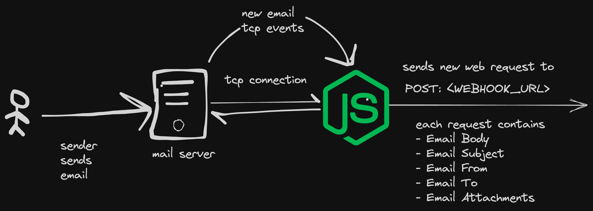

# Mail Listener

Listens for new mail on your IMAP server and perform POST request to a webhook URL.


## Environment variables needed:

You can format the given information into a Markdown table like this:

| Variable    | Value                 | Description             |
| ----------- | --------------------- | ----------------------- |
| PASSWORD    | Password              | password of imap server |
| USERNAME    | user@example.com      | username of imap server |
| HOST        | imap.example.com      | host of imap server     |
| PORT        | 993                   | port of imap server     |
| WEBHOOK_URL | http://127.0.0.1:3000 | Webhook send request to |

## Webhook request format

| Variable    | Description                                                       | Possible Values                                      |
| ----------- | ----------------------------------------------------------------- | ---------------------------------------------------- |
| attachments | This variable holds the attachments from the incoming mail.       | Array of attachments or `Absent` (field not present) |
| html        | This variable holds the HTML content of the incoming mail.        | HTML string or `false` (for non-HTML emails)         |
| text        | This variable holds the text content of the incoming mail.        | Text string                                          |
| from        | This variable holds the sender's address of the incoming mail.    | Email string                                         |
| to          | This variable holds the recipient's address of the incoming mail. | Email string                                         |
| data        | An object containing html, text, from, and to values.             | Object                                               |

## Docker usage

Please note that this image doesn't need any open ports to run and hence the docker image is without `EXPOSE`.

## Development Usage

```bash

git clone https://github.com/n1rjal/mail-listener.git
cd mail-listener

## Setup environment variables
pnpm install
pnpm dev

```

## Future Features

1. Publish to SQS Queue
2. Publish to RABBITMQ exchange
